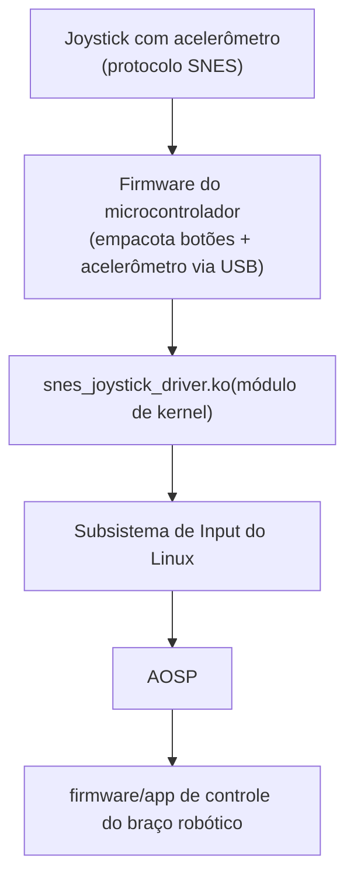

# DevTITANS 09 - HandsOn Final - Equipe 03

Bem-vindo ao repositório da Equipe 03 no DevTITANS! A equipe deverá criar um joystick com acelerômetro (que implemente o protocolo do Super Nintendo -> SNES), para integrá-lo a uma Raspberry Pi em que iremos instalar o AOSP e, a partir de disso tudo, controlar um braço robótico.

- [Contribuidores](#contribuidores)
- [Recursos](#recursos)
- [Arquitetura do Driver](#arquitetura-do-driver)
- [Uso](#uso)
- [Contato](#contato)

## Contribuidores

**Time do Raspberry** 
- **Thiago Pereira Lopes Chaves:** Criar o repositório do trabalho. Trabalhar na instalação/configuração do AOSP na Raspberry Pi. 

**Time do Firmware/Joystick** 
- **Laura Nunes Belém:** Confeccionar o joystick e implementar seu firmware. Confeccionar o braço robótico. 

**Time do Driver** 
- **Raphael Vasconcelos Nunes de Mello:** Implementar o driver para comunicação do joystick com a Raspberry Pi.
- **William Roberto dos Santos Pereira:** Trabalhar na comunicação Joystick X Raspberry Pi X Braço Robótico.
- **Caio Cesar Faneco Gonzaga:** Trabalhar na comunicação Joystick X Raspberry Pi X Braço Robótico.

## Recursos

{Liste os recursos necessários como sensores, dispositivos, etc.}

1. **Raspberry Pi** 
    - **Modelo**: 
        - <ins>Mínimo</ins>: Raspberry Pi 4 Model B. / <ins>Desejável</ins>: Raspberry Pi 5 Model B. 
    - **Memória**: 
        - <ins>Mínimo</ins>: 4 GB RAM. / <ins>Desejável</ins>: 16 GB RAM. 
    - **Armazenamento:** 
        - <ins>Mínimo</ins>: Micro SD Card 32 GB. / <ins>Desejável</ins>: Micro SD Card 128 GB. 
    - **Carregador**: [Raspberry Pi 15W USB-C Power Supply](https://www.raspberrypi.com/products/type-c-power-supply/). 
    - **Capa**: [Raspberry Pi 4 Case](https://www.raspberrypi.com/products/raspberry-pi-4-case/). 
    - **Ventilação**: [Raspberry Pi 4 Case Fan](https://www.raspberrypi.com/products/raspberry-pi-4-case-fan/). 
    - **Periféricos**: 
        - <ins>Câmera</ins>: [Raspberry Pi Global Shutter Camera](https://www.raspberrypi.com/products/raspberry-pi-global-shutter-camera/) (para possível funcionalidade extra com o braço mecânico + visão computacional. Um conector CSI para ligar à Raspberry Pi é necessário). 
        - <ins>Sensor de Distância</ins>: A se definir (para possível funcionalidade extra com o braço mecânico). 
        - <ins>Display</ins>: [Raspberry Pi Touch Display 2](https://www.raspberrypi.com/products/touch-display-2/) (para possível funcionalidade extra com braço mecânico ou com um jogo de emulador).
2. **Joystick** 
   - **ESP32** 
   - **Joystick Analógico** 
   - **Botões** 
       - <ins>6unid</ins> 
   - **Resistor** 
         - <ins>6unid</ins>10K Ohm 
   - **Capacitor** 
         - <ins>6unid</ins>Cerâmico 104 
   - **Acelerômetro** 
4. **Braço Robótico** 
   - ??? 
   - ??? 

## Arquitetura do Driver

**Decisões da equipe:** o joystick se comunicará com a Raspberry Pi **via cabo (USB)**. O driver de comunicação será desenvolvido como um módulo de kernel Linux — um driver USB "puro" que fala diretamente com o dispositivo.

### Visão geral

### Como o driver funciona

O módulo (`snes_joystick_driver.c`) é um driver USB registrado via `struct usb_driver`, com quatro partes principais:

| Parte | Responsabilidade |
|---|---|
| `usb_device_id` | Identifica o dispositivo pelo Vendor ID / Product ID definidos pelo Time do Firmware |
| `probe()` | Cria o `input_dev`, declara botões (`EV_KEY`) e eixos do acelerômetro (`EV_ABS`), e prepara a URB de interrupção USB |
| Callback de IRQ da URB | Executado a cada pacote recebido via USB; faz o parsing dos bytes crus e chama `input_report_key()` / `input_report_abs()` / `input_sync()` |
| `disconnect()` | Libera os recursos quando o cabo é removido |

### Pendências antes de compilar o driver final

- [ ] Confirmar com o Time do Firmware/Joystick o **Vendor ID / Product ID** reais do dispositivo.
- [ ] Confirmar o **layout exato do relatório USB** (quais bytes/bits correspondem a cada botão e a cada eixo do acelerômetro).

### Ferramentas de validação

- `dmesg` — confirma se o `probe()` do driver rodou sem erro ao conectar o dispositivo.
- `evtest` — mostra os eventos de botão/eixo gerados pelo driver em tempo real.
- `adb shell getevent -lt /dev/input/eventX` — mesma validação, já rodando o AOSP.

## Uso

{Instruções para reproduzir as alterações no AOSP}

## Contato

Para perguntas, sugestões ou feedback, entre em contato com o mantenedor do projeto em [thiago.chaves@icomp.ufam.edu.br](thiago.chaves@icomp.ufam.edu.br).
